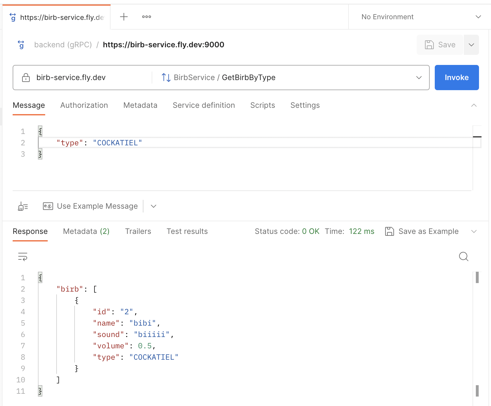

# Birb Service

[](https://vertx.io)

This birb application was generated using http://start.vertx.io

-----------
A gRPC service that provides methods to get birb information.

### Deployed at https://birb-service.fly.dev

Call gRPC request using Postman, import protobuf from `./src/main/java/protp/Birb.proto`.

GetBirbByType Request:
```
{
    "type": "COCKATIEL"
}
```

## gRPC Methods

| Methods               | Description                                                      |
|-----------------------|------------------------------------------------------------------|
| `GetBirb`             | Retrieve detailed information about a bird by its unique ID.    |
| `GetBirbByType`       | Get a list of birds belonging to a specific bird type.           |

## Protobuf Schema

#### `Birb`

A message representing bird data, including its ID, name, sound, volume, and type.

| Field   | Type    | Description                          |
|---------|---------|--------------------------------------|
| `id`    | int64   | Unique identifier for the bird.      |
| `name`  | string  | The name of the bird.                |
| `sound` | string  | The sound the bird makes.           |
| `volume`| float   | The volume of the bird's sound.     |
| `type`  | BirbType| The type of the bird (e.g., Cockatiel, Lovebird, etc.).

#### `GetBirbRequest`

A message for specifying the ID of the bird you want to retrieve.

| Field   | Type    | Description                          |
|---------|---------|--------------------------------------|
| `id`    | int64   | Unique identifier for the bird you want to retrieve.

#### `GetBirbResponse`

A message containing the detailed information of the retrieved bird.

| Field   | Type    | Description                          |
|---------|---------|--------------------------------------|
| `birb`  | Birb    | The bird data that has been retrieved.

#### `GetBirbByTypeRequest`

A message for specifying the bird type to filter birds.

| Field   | Type    | Description                          |
|---------|---------|--------------------------------------|
| `type`  | BirbType| The type of bird for filtering.

#### `GetBirbByTypeResponse`

A message containing a list of birds of the specified type.

| Field   | Type    | Description                          |
|---------|---------|--------------------------------------|
| `birb`  | repeated Birb | A list of birds belonging to the specified type.


## Calling the gRPC endpoints

1. Using grpcurl.

```bash
grpcurl -plaintext -d '{"id": 1}' -import-path ./proto -proto birb.proto localhost:50051 birb.BirbService/GetBirb
```

```bash
grpcurl -plaintext -d '{"type": PIGEON}' -import-path ./proto -proto birb.proto localhost:50051 birb.BirbService/GetBirbByType
```

2. Using Postman (Not sure why it kept crashing on meeeee) `localhost:9000`, import Birb.proto and select GetBirb orGetBirbByType method.

#### GetBirbBy Message
```
{
    "id": "1"
}
```

#### Response
```
{
    "birb": {
        "id": "1",
        "name": "ah",
        "sound": "ahhhhh",
        "volume": 0.10000000149011612,
        "type": "PIGEON"
    }
}
```

#### GetBirbByType Message
```
{
    "type": "PIGEON"
}
```

#### Response
```
{
    "birb": [
        {
            "id": "1",
            "name": "ah",
            "sound": "ahhhhh",
            "volume": 0.10000000149011612,
            "type": "PIGEON"
        },
        {
            "id": "3",
            "name": "caca",
            "sound": "caaacaaaa",
            "volume": 0.30000001192092896,
            "type": "PIGEON"
        },
        {
            "id": "5",
            "name": "eheh",
            "sound": "eheheheh",
            "volume": 0.30000001192092896,
            "type": "PIGEON"
        }
    ]
}
```

## Getting Started

To build protobuf:
```
./gradlew generateProto
```

To launch your tests:
```
./gradlew clean test
```

To package your application:
```
./gradlew clean assemble
```

To run your application:
```
./gradlew clean run
```


# Run using Docker
### Build a fat jar
```
./gradlew assemable
```
### Create a Docker image

```
➜  birb-service git:(main) ✗ docker login
➜  birb-service git:(main) ✗ docker build -t mysmolthing/birb-service:1.0 .
➜  birb-service git:(main) ✗ docker push mysmolthing/birb-service:1.0

➜  birb-service git:(main) ✗ docker images
REPOSITORY                    TAG       IMAGE ID       CREATED         SIZE
birb-service                  1.0       bb7e45e84d79   2 days ago      339MB
```

### Create Kubernetes namespace
```
➜  birb-service git:(main) ✗ kubectl create namespace smolthing
namespace/smolthing created
➜  birb-service git:(main) ✗ kubectl get namespaces

NAME              STATUS   AGE
default           Active   208d
kube-node-lease   Active   208d
kube-public       Active   208d
kube-system       Active   208d
smolthing         Active   13s
➜  birb-service git:(main) ✗ kubectl apply -f deploy/deployment.yml -n smolthing

deployment.apps/birb-service created

```
### Expose Kubernetes portq
```
➜  birb-service git:(main) ✗ kubectl get pods
NAME                           READY   STATUS    RESTARTS        AGE
birb-service-8584574d7-h2tdt   1/1     Running   0               16s
birb-service-8584574d7-mkp8z   1/1     Running   0               16s

➜  birb-service git:(main) ✗ kubectl port-forward birb-service-8584574d7-h2tdt 9000:9000
Forwarding from 127.0.0.1:9000 -> 9000
Forwarding from [::1]:9000 -> 9000
```
